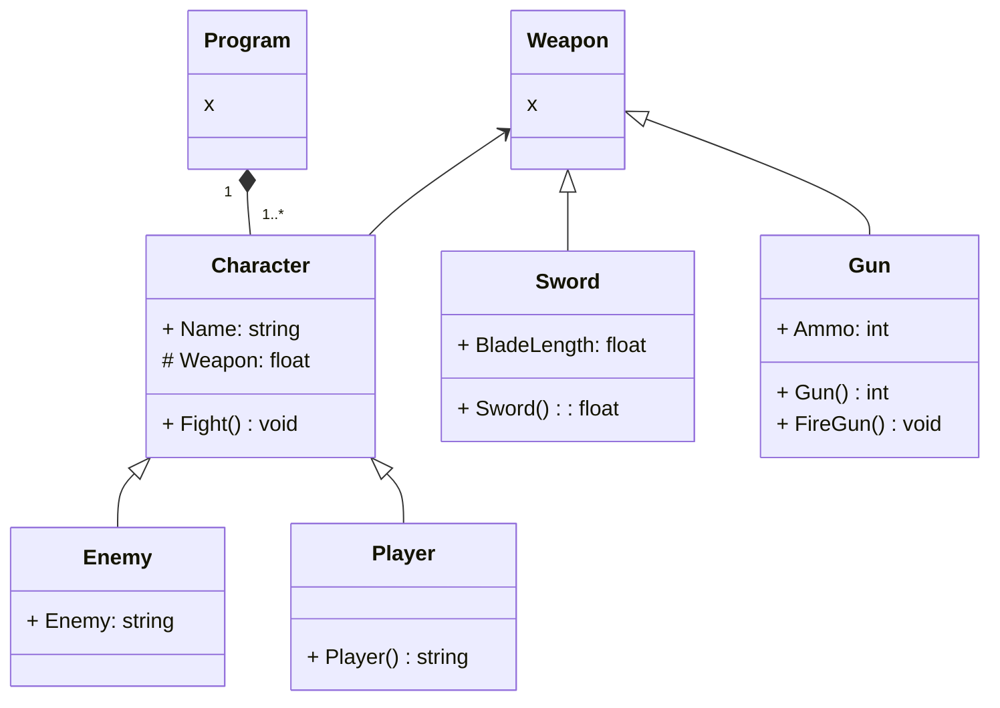

# UML Diagram for MiniGame

```mermaid

classDiagram

    class Program {
        x
    }

    class Character {
        + Name: string
        + Fight()void
        # Weapon: float
    }

    class Enemy {
        + Enemy: string
    }

    class Player {
        + Player()string
    }

    class Weapon {
        x
    }

    class Sword {
        + BladeLength: float
        + Sword(): float
    }

    class Gun {
        + Ammo: int
        + Gun()int
        + FireGun()void
    }


    Program "1" *-- "1..*" Character

    Character <|-- Enemy
    Character <|-- Player

    Weapon <-- Character
    Weapon <|-- Sword
    Weapon <|-- Gun

```